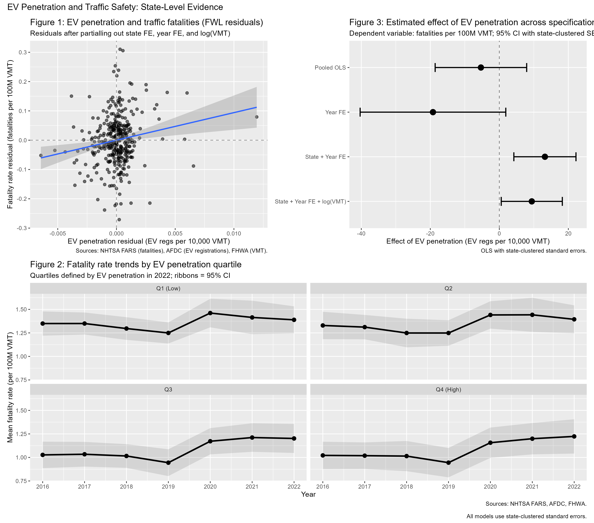

# EV Penetration & Traffic Safety (2016–2022)

## Project summary

This project builds a **state-by-year panel (2016–2022)** to examine whether higher **electric vehicle (EV) penetration** is associated with changes in **traffic fatality rates**. It combines three public sources: **NHTSA FARS** for fatalities, **AFDC/NREL** for state EV registrations, and **FHWA VM-2** for vehicle miles traveled (VMT). The included dataset in `data/raw/` provides VMT by state and year.

After harmonizing these sources, the pipeline constructs (1) **fatalities per 100 million VMT** and (2) an interpretable EV intensity proxy, **EV registrations per 10,000 VMT**. The analysis then estimates progressively richer regression specifications, culminating in a **two-way fixed-effects model** (state and year fixed effects) with **state-clustered standard errors** and a control for **log(VMT)** to account for exposure and scale differences across states.

Figures include a **Frisch–Waugh–Lovell (FWL) residual plot**, **fatality trends by EV-penetration quartile**, and a **coefficient comparison plot** across model variants—helping distinguish raw correlations from within-state changes over time.

Finally, the project includes an optional robustness check that models fatalities as a **count outcome** using a **Poisson specification with a VMT exposure offset**. The end result is a clean, cloneable research workflow that demonstrates data acquisition, panel construction, causal-style econometric design (fixed effects + clustering), and clear communication through tables and visualizations.

---

## Repository layout

- `data/raw/`  
  - `vmt_state_year_2015_2022_from_vm2.csv` (included)
- `data/cache/` FARS zips downloads are cached here
- `R/` reusable functions (download/load helpers, panel build, models, figures)
- `scripts/run_all.R` one-command reproduction script
- `outputs/` generated tables/figures (ignored by git)

## How to run

1. Clone the repo
2. Install packages (or use renv)

```r
install.packages(c("dplyr","tidyr","purrr","stringr","readr","ggplot2","scales",
                   "fixest","modelsummary","patchwork","readxl","janitor","fs","glue","forcats", "rvest", "xml2"))
```

3. Run the pipeline

```bash
Rscript scripts/run_all.R
```

Outputs:
- `outputs/tables/regression_table.html`
- `outputs/tables/poisson_table.html`
- `outputs/figures/fig1_fwl.png`
- `outputs/figures/fig2_trends.png`
- `outputs/figures/fig3_coefplot.png`
- `outputs/figures/ev_safety_figures_combined.png`


## Results



Across all specifications, EV penetration shows no statistically significant 
association with traffic fatality rates. Point estimates are sensitive to 
model choice — pooled OLS suggests a near-zero positive effect, while adding 
year fixed effects produces a negative estimate — indicating that cross-sectional 
comparisons are confounded by state-level characteristics. The preferred 
two-way fixed-effects specification (state + year FE, clustered SEs) yields 
a positive but imprecise estimate, consistent with null results in the 
within-state variation. Results are robust to a Poisson count model with 
VMT exposure offset.

## Notes on data

- **FARS** is downloaded automatically from NHTSA’s annual “National CSV” zip for each year.  
- **AFDC EV registrations** are scraped from the AFDC website (afdc.energy.gov/vehicle-registration) for each year 2016–2022.
- **VMT** uses the included `data/raw/vmt_state_year_2015_2022_from_vm2.csv` (covers 2015-2022; but the analysis utilizes 2016-2022).

## Another Sidenote

EV penetration is measured as registrations per 10,000 VMT rather than 
as a share of the total vehicle fleet, which is the more conventional 
measure. This conflates EV adoption with driving intensity and should 
be interpreted with caution.

## License

MIT
